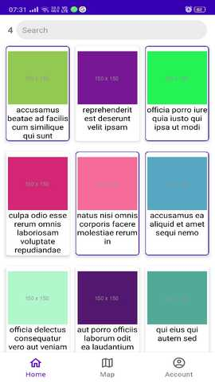
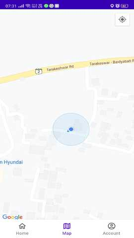
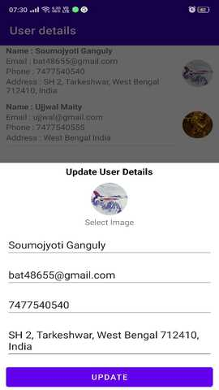

# Webskitters-Machine-Test
1. Use navigation architecture to implement the bottom nav view and use fragment for this.
2. Implement MVVM, Kotlin, Coroutine, ROOM for API calling Retrofit is used.
3. Google MAP and get current location Implemented.

